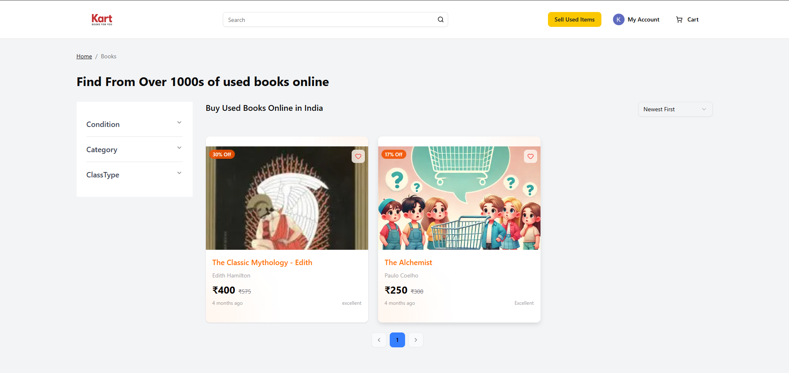
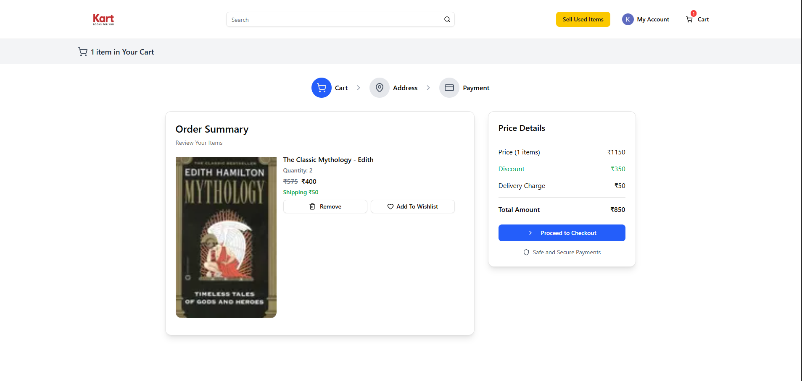

<h1 align="center">Kart</h1>

<p align="center">
  <b>India's Premier Marketplace for Buying & Selling Used Books</b>
  <br />
  <a href="https://github.com/Shades3101/Kart-app"><strong>Explore the docs »</strong></a>
  <br />
  <br />
  <a href="#">View Demo</a>
  ·
  <a href="https://github.com/Shades3101/Kart-app/issues">Report Bug</a>
  ·
  <a href="https://github.com/Shades3101/Kart-app/issues">Request Feature</a>
</p>

<p align="center">
  
  
  
</p>

<br />

---

## 📖 Table of Contents
- [About The Project](#-about-the-project)
- [Key Features](#-key-features)
- [Tech Stack](#-tech-stack)
- [Project Structure](#-project-structure)
- [Screenshots](#-screenshots)
- [Getting Started](#-getting-started)
- [Usage](#-usage)
- [Contributing](#-contributing)
- [License](#-license)

---

## 📖 About The Project

**Kart** is a dedicated peer-to-peer marketplace designed to give old books a new home. We connect book lovers across India, fostering a sustainable reading culture by allowing users to trade pre-loved books effortlessly.

### Built With
Kart leverages a modern full-stack architecture to provide a lightning-fast and secure experience:
*   **Next.js 15+** for the dynamic and responsive frontend.
*   **Node.js & Express** for a scalable backend API.
*   **MongoDB** for flexible data storage.
*   **Redux Toolkit** for seamless state management.

---

## ✨ Key Features

| Feature | Description |
| :--- | :--- |
| 📚 **Marketplace** | A complete ecosystem to list, browse, and buy used books. |
| 📝 **Ad Posting** | Simple 3-step listing process for sellers. |
| 🔐 **Auth** | Secure Google OAuth and JWT-based authentication. |
| 🛒 **Smart Cart** | Advanced cart management for multiple items and sellers. |
| ❤️ **Wishlist** | Keep track of books you want to read next. |
| 📦 **Orders** | Real-time order tracking and management. |
| 💳 **Payments** | Integrated **Razorpay** for secure financial transactions. |
| 📍 **Addresses** | Multiple shipping address support for user convenience. |
| 📱 **Responsive** | Optimized for mobile, tablet, and desktop views. |

---

## 🛠️ Tech Stack

### 🎨 Frontend
<p align="left">
  
  
  
  
  
</p>

### ⚙️ Backend
<p align="left">
  
  
  
  
</p>

### 🛠️ Infrastructure & Tools
<p align="left">
  
  
  
</p>

---

## 📂 Project Structure

```bash
Kart/
├── 📁 backend/             # Node.js & Express API
│   ├── 📁 src/
│   │   ├── 📁 config/      # DB & Cloudinary Configuration
│   │   ├── 📁 controllers/ # Business Logic
│   │   ├── 📁 middleware/  # Authentication & File Uploads
│   │   ├── 📁 models/      # Mongoose Schemas
│   │   ├── 📁 routes/      # Express Routes
│   │   └── 📁 utils/       # Utility Functions
│   └── 📄 package.json
│
└── 📁 frontend/            # Next.js 13+ App Router
    ├── 📁 app/             # Application Pages
    │   ├── 📁 account/     # User Profile & Dashboard
    │   ├── 📁 books/       # Marketplace Listings
    │   ├── 📁 book-sell/   # Seller Onboarding Flow
    │   ├── 📁 checkout/    # Order & Payment Flow
    │   └── 📁 components/  # Reusable UI Library
    ├── 📁 public/          # Static Assets & Icons
    └── 📄 package.json
```

---

## 📸 Screenshots

<div align="center">
  <table border="0">
    <tr>
      <td align="center">
        <b>✨ Landing Page</b><br />
        
      </td>
      <td align="center">
        <b>🛍️ Product Details</b><br />
        
      </td>
    </tr>
    <tr>
      <td align="center">
        <b>📚 Marketplace</b><br />
        
      </td>
      <td align="center">
         <b>🛒 Shopping Flow</b><br />
         
      </td>
    </tr>
  </table>
</div>

---

## 🚀 Getting Started

### Prerequisites
*   Node.js (v18+)
*   MongoDB Atlas or Local Instance
*   npm or pnpm

### Setup

1. **Clone the Repo**
   ```bash
   git clone https://github.com/Shades3101/Kart-app.git
   cd lumiere
   ```

2. **Server Configuration**
   ```bash
   cd backend && npm install
   cp .env.example .env # Or manually create it
   ```

3. **Client Configuration**
   ```bash
   cd ../frontend && npm install
   cp .env.example .env.local
   ```

### Execution
Run both servers in separate terminals:
```bash
# Backend
npm run dev

# Frontend
npm run dev
```

---

## 🤝 Contributing

We ❤️ contributions! Check out our [contribution guidelines](#) to get started.

1. Fork the Project
2. Create Feature Branch (`git checkout -b feature/AmazingFeature`)
3. Commit Changes (`git commit -m 'Add AmazingFeature'`)
4. Push to Branch (`git push origin feature/AmazingFeature`)
5. Open a Pull Request

---

## 📄 License

Distributed under the **ISC License**. See `LICENSE` for more information.

<div align="center">
  <br />
  
  
  
</div>
